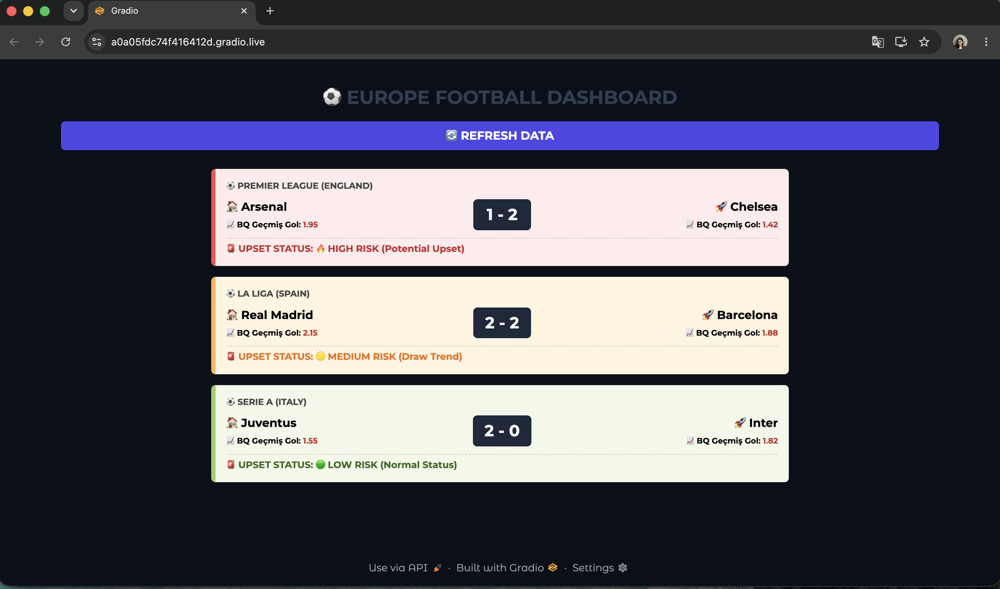
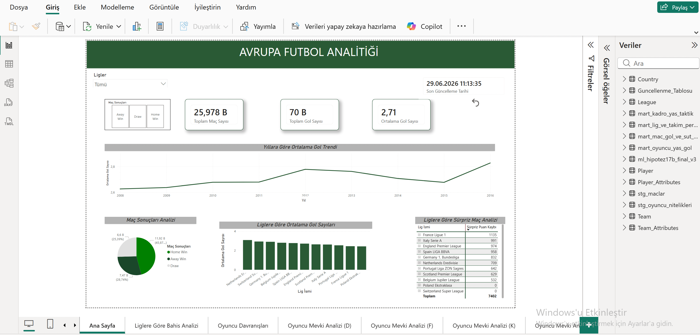
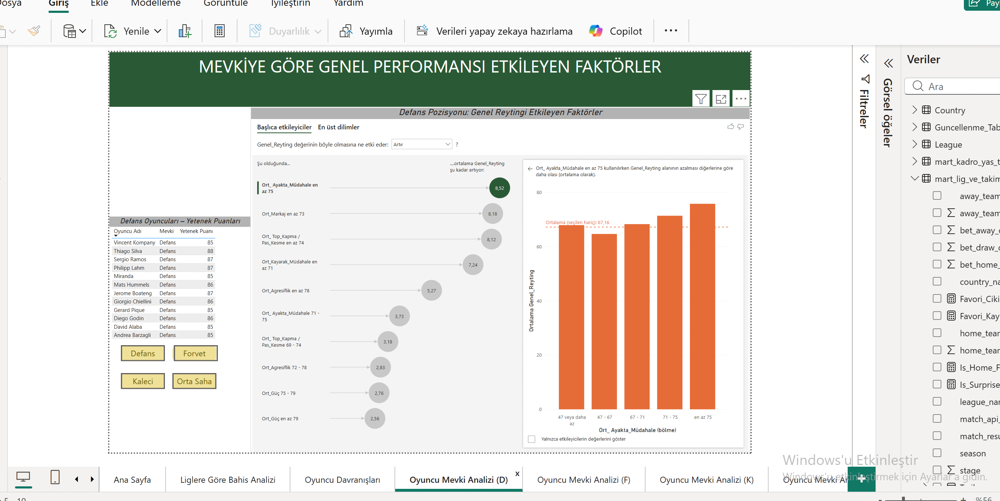
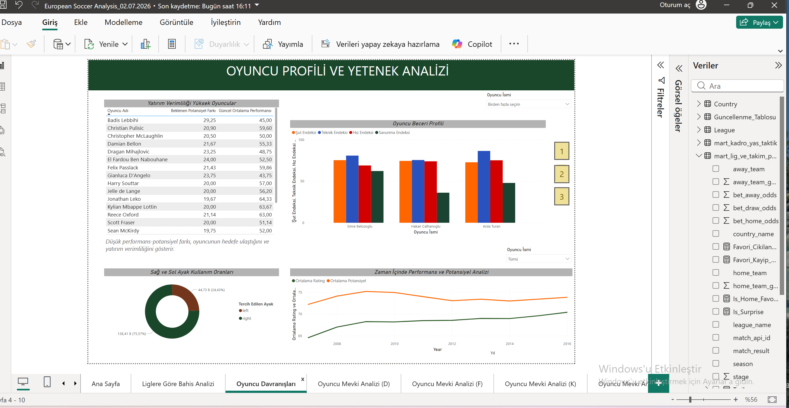
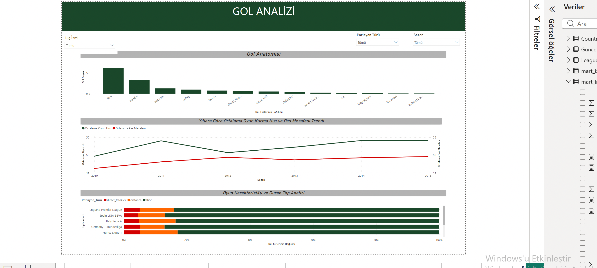
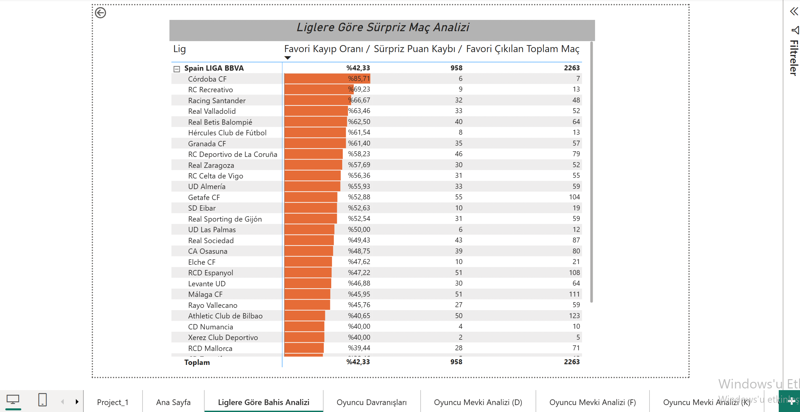

## 📊 Rapor ve Web Uygulaması Görselleri

### 📱 Canlı Skor Paneli & Akıllı Sürpriz (Upset) Algoritması Arayüzü
API-Sports üzerinden çekilen canlı maç skorları ile BigQuery veri ambarından (BQ Geçmiş Gol) beslenen tarihsel verilerin harmanlandığı, Streamlit/Gradio tabanlı web uygulaması arayüzü.

### 1. Avrupa Futbol Analitiği (Ana Sayfa)
Avrupa liglerindeki genel durum, toplam maç/gol sayıları ve liglere göre sürpriz maç analizlerinin yer aldığı ana panel.

# ⚽ European Football Live Score & Smart Upset Analytics

Bu proje, canlı futbol verilerini API üzerinden anlık olarak çekip, Google BigQuery üzerinde modellenmiş tarihsel veri setiyle harmanlayan ve akıllı sürpriz (upset) tespiti yapan bir veri bilimi web uygulamasıdır. Proje kapsamında ayrıca geniş ölçekli bir iş zekası (BI) ve scouting raporlama arayüzü geliştirilmiştir.

## 🛠️ Teknolojik Mimari

* **Veri Kaynağı:** API-Sports (Live Fixtures API)
* **Veri Ambarı & Modelleme:** Google BigQuery (Historical Soccer Dataset)
* **Arayüz Tasarımı:** Gradio UI & Streamlit (HTML/CSS Enriched)
* **Geliştirme Ortamı:** Google Colab
* **İş Zekası (BI) & Analiz:** Power BI Desktop

---

## 📊 Rapor ve Dashboard Görselleri

### 1. Avrupa Futbol Analitiği (Ana Sayfa)
Avrupa liglerindeki genel durum, toplam maç/gol sayıları ve liglere göre sürpriz maç analizlerinin yer aldığı ana panel.

### 2. Mevki Analizi & Gelişmiş AI Etkileyiciler (Defans)
Power BI AI "Key Influencers" görseli kullanılarak oyuncuların genel reytinglerini en çok etkileyen defansif metriklerin analizi.

### 3. Oyuncu Profili ve Yetenek Analizi
Oyuncuların şut, teknik, hız ve savunma indekslerinin karşılaştırmalı analizi, yaşa göre performans trendleri ve yatırım verimliliği.

### 4. Gol Anatomisi ve Duran Top Analizi
Lig bazında gollerin nasıl atıldığı (şut, kafa, penaltı vb.), oyun kurma hızı ve pas mesafelerinin yıllara göre değişimi.

### 5. Yaş Eğrisi & Kadro Planlaması
Oyuncu sayısının ve ortalama performansın yaş gruplarına göre dağılımı ile hücuma kalkış hızına göre kadro yaş analizi.

### 6. Liglere Göre Bahis ve Sürpriz Analizi
Liglerin sürpriz skor üretme eğilimleri ve kazanç/kayıp marjlarının analitik dağılımı.

---

## 📂 Proje Yapısı
* `european_soccer_live_matches.ipynb`: Canlı veri çekme, BigQuery entegrasyonu ve modelleme süreçlerini içeren Jupyter Notebook.
* `European Soccer Analysis_02.07.2026.pbix`: Gelişmiş analitik modelleri ve yukarıdaki tüm görselleri barındıran orijinal Power BI rapor dosyası.
