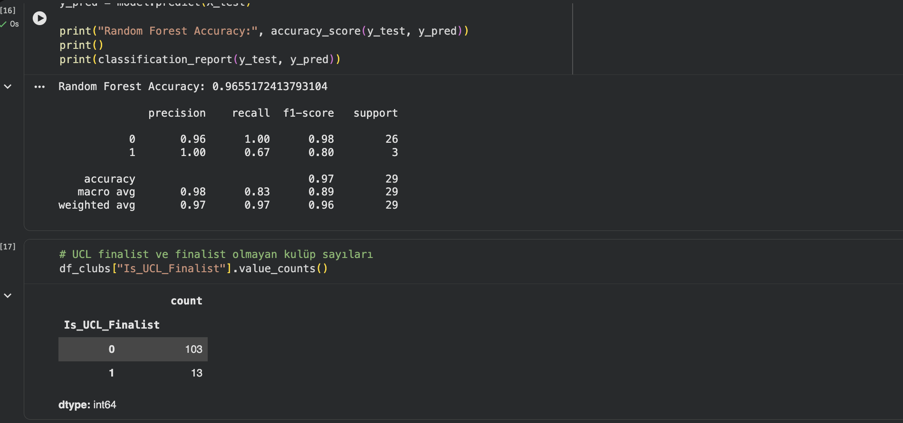
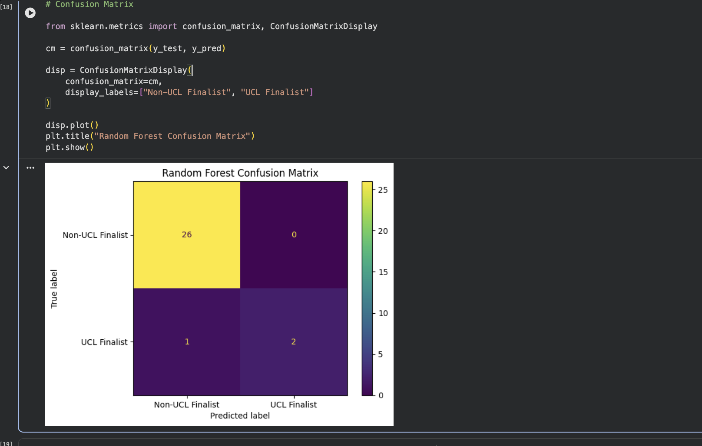
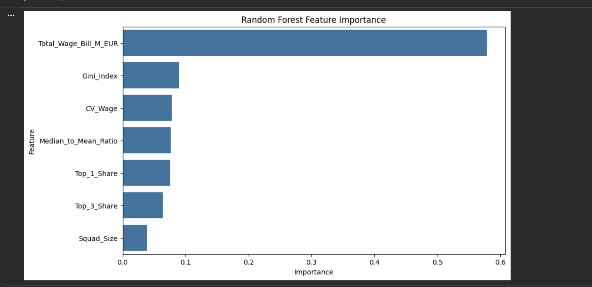

# 🏆 UCL Finalist Profile Predictor

Bu proje; Avrupa kulüplerinin maaş yapılarını, kadro derinliklerini ve finansal dağılım metriklerini analiz ederek, hangi takımların tarihsel UCL finalist profiliyle uyuştuğunu tahmin eden veri odaklı bir makine öğrenmesi projesidir. 

Proje kapsamında, dengesiz veri kümesi üzerinde eğitilen yüksek başarımlı bir model ve kullanıcıların kulüpleri simüle edebileceği dinamik bir web arayüzü geliştirilmiştir.

---

## 🤖 Makine Öğrenmesi & Model Performansı

Veri kümesindeki ciddi sınıf dengesizliğine (Imbalanced Data: 103 Finalist Olmayan vs 13 Finalist Kulüp) rağmen, model maliyete duyarlı yaklaşımlarla optimize edilmiş ve **Random Forest** algoritması kullanılarak yüksek metrik başarılarına ulaşılmıştır.

### 1. Model Başarı Metrikleri (Classification Report)
Model, test verisi üzerinde **%96.5** genel doğruluk (Accuracy) oranına ulaşmıştır. Finalist profillerini yakalama (Recall) ve isabet (Precision) dengesi optimize edilmiştir.

### 2. Hata Matrisi (Confusion Matrix)
Modelin test kümesindeki tahmin performansını gösteren Hata Matrisi; finalist olmayan takımları sıfır hata ile ayırt edebildiğini göstermektedir.

### 3. Öznitelik Önemi (Feature Importance)
Modelin karar verme sürecinde en çok etki eden metrikler listelenmiştir. Kulübün toplam maaş bütçesi (`Total_Wage_Bill_M_EUR`) açık ara en baskın faktörken, maaş adaletini/dağılımını gösteren **Gini Endeksi** (`Gini_Index`) ikinci en önemli ayırt edici unsur olmuştur.

---

## 📱 Streamlit Kullanıcı Arayüzü & Simülasyonlar

Geliştirilen dinamik arayüz üzerinden seçilen kulüplerin finansal profillerinin UEFA Şampiyonlar Ligi finali oynamaya ne kadar yatkın olduğu anlık olarak simüle edilebilmektedir.

### 1. Negatif Eşleşme Simülasyonu (Örn: FC Köln)
Maaş bütçesi ve finansal dağılımı tarihsel finalist profillerine uymayan kulüpler için düşük olasılıkla birlikte negatif geri bildirim arayüzü tetiklenir.

### 2. Pozitif Eşleşme Simülasyonu (Örn: Real Madrid)
Tarihsel finalist şablonuna tam uyum sağlayan dev bütçeli kulüplerde yüksek olasılık puanı (`%84.5`) hesaplanarak yeşil onay arayüzü gösterilir.

---

## 🛠️ Kullanılan Teknolojiler ve Finansal Metrikler

* **Veri Mühendisliği & ML:** Python, Pandas, Scikit-Learn (Random Forest Classifier)
* **Kullanıcı Arayüzü:** Streamlit Web Framework
* **Türetilen Finansal Öznitelikler:** `Total_Wage_Bill_M_EUR`, `Gini_Index`, `CV_Wage` (Katsayı Varyansı), `Median_to_Mean_Ratio`, `Top_1_Share`, `Top_3_Share`, `Squad_Size`.
